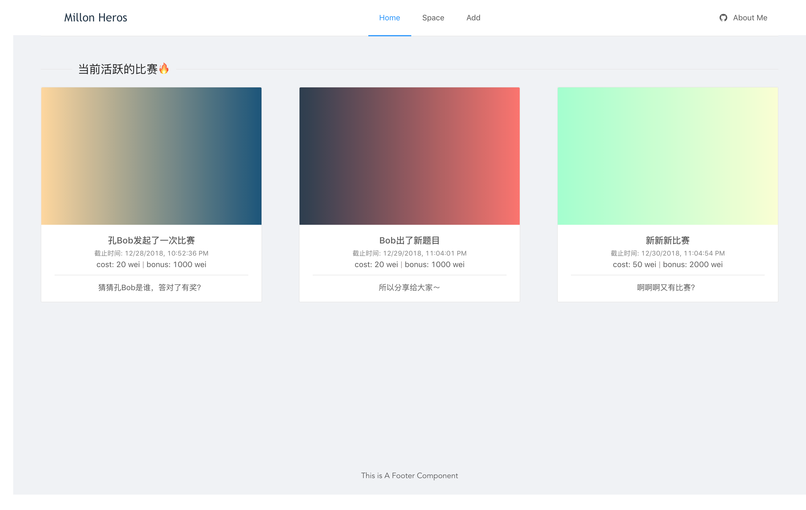
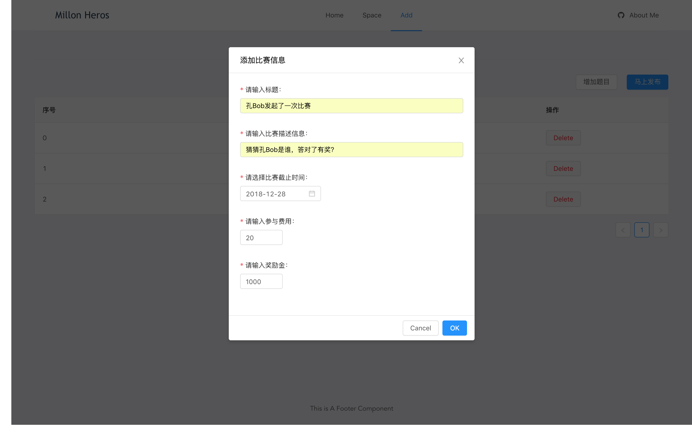
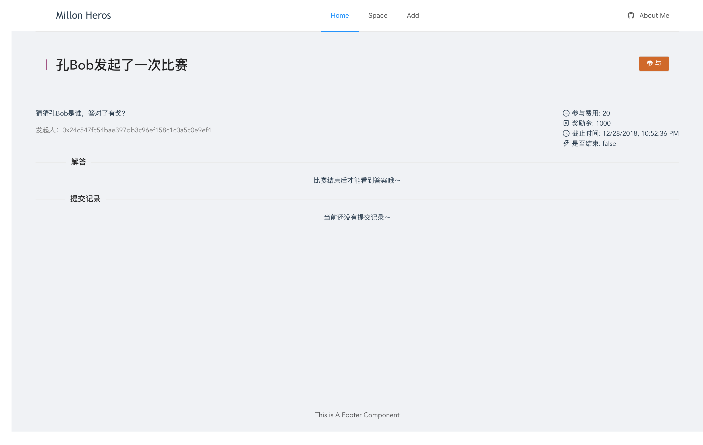
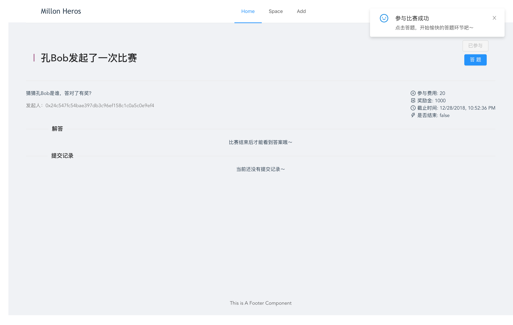
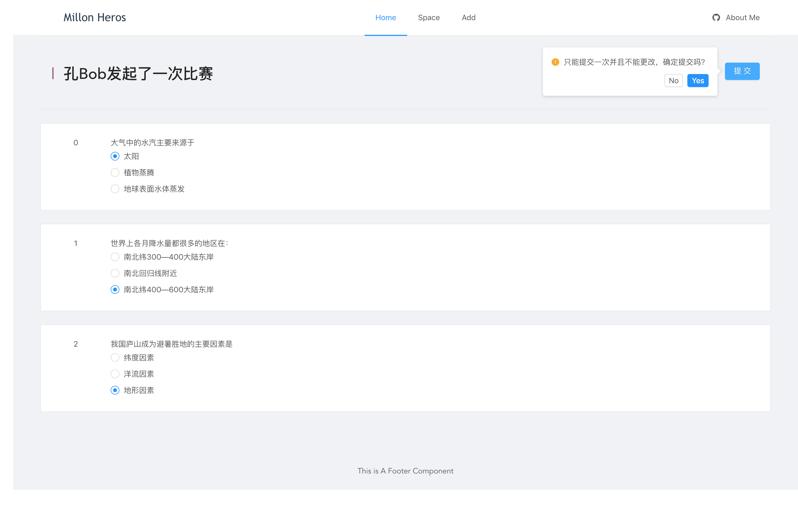
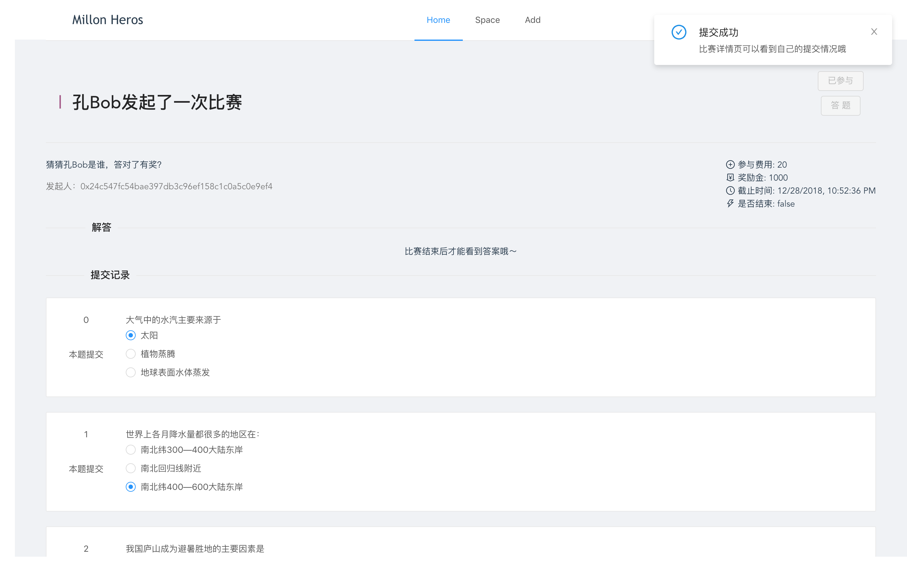
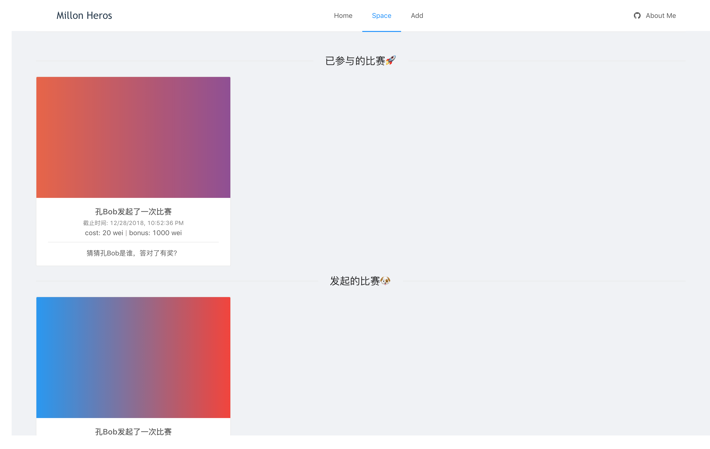

# 使用说明

## 总览

应用主体界面如下：

`Home`模块显示当前合约上已经部署的所有比赛，而`Space`模块则显示用户相关的比赛，包括其参与和发起的所有比赛；`Add`模块则是出题页面，其中有一个出题列表，用户可自行设置题目内容，然后作为发起者发起一场新的比赛～

## 发起一个新的比赛

通过在add页出题，然后添加比赛的相应信息，从而发起一次新的比赛。（目前出题方式只支持选择题）发起比赛需要花一定的费用，与用户设定的奖金挂钩，同时也会收取一定的手续费。

## 比赛详情页

点击主页的比赛卡片，可以进入该场比赛对应的详情界面，其中会显示: 比赛的标题、比赛的描述信息、比赛发起人地址、比赛的参与费用、比赛的奖励金、比赛的截止时间、比赛是否已经结束。

如果比赛已经结束，则在解答区域会显示出对应的答案；如果用于已经参与这次比赛并且成功提交了答案，则在提交记录会显示出用户提交的内容。

下面是未参与这场比赛之前的界面：

点击参与之后可以进入答题界面：

进入答题界面：

提交回答并查看提交结果：

## 个人空间页

个人空间页用于显示用户参加过的比赛以及用户发起过的比赛：

